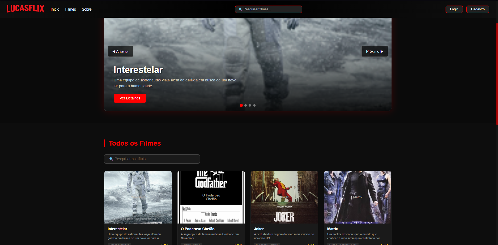
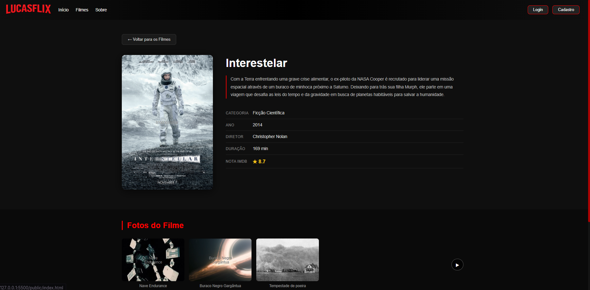

# Trabalho Prático - Semana 11

Nesta atividade, vamos evoluir o projeto em que estamos trabalhando nesse semestre, acrescentando a página de detalhes.

Imagine que a página principal (home-page) mostre um visão dos vários itens que existem no seu site. Ao clicar em um item, você é direcionado pra a página de detalhes. A página de detalhe vai mostrar todas as informações sobre o item do seu projeto, seja esse item uma notícia, filme, receita, lugar turístico ou evento.

## Informações Gerais

- Nome: Lucas Stefanon
- Matricula: 1659984
- Decreva brevemente seu projeto

## Prints do trabalho





## Dados em JSON
Inclua aqui a estrutura de dados definida por você para o projeto com pelo menos dois exemplo de dados.

```json
{
    "filmes": [
        {
            "id": 1,
            "titulo": "Interestelar",
            "descricao": "Uma equipe de astronautas viaja além da galáxia em busca de um novo lar para a humanidade.",
            "conteudo": "Com a Terra enfrentando uma grave crise alimentar, o ex-piloto da NASA Cooper é recrutado para liderar uma missão espacial através de um buraco de minhoca próximo a Saturno. Deixando para trás sua filha Murph, ele parte em uma viagem que desafia as leis do tempo e da gravidade em busca de planetas habitáveis para salvar a humanidade.",
            "categoria": "Ficção Científica",
            "ano": 2014,
            "imagem": "https://upload.wikimedia.org/wikipedia/en/b/bc/Interstellar_film_poster.jpg"
        },
        {
            "id": 2,
            "titulo": "O Poderoso Chefão",
            "descricao": "A saga épica da família mafiosa Corleone em Nova York.",
            "conteudo": "Vito Corleone é o patriarca de uma das famílias mafiosas mais poderosas de Nova York. Quando recusa apoio a um traficante rival, sua família é arrastada para uma guerra brutal. Seu filho caçula Michael, que tentava se manter longe do crime organizado, é forçado a assumir o negócio da família após um atentado contra o pai.",
            "categoria": "Drama / Crime",
            "ano": 1972,
            "imagem": "https://upload.wikimedia.org/wikipedia/en/1/1c/Godfather_ver1.jpg"
        },
        {
            "id": 3,
            "titulo": "Joker",
            "descricao": "A perturbadora origem do vilão mais icônico do universo DC.",
            "conteudo": "Arthur Fleck é um comediante fracassado e perturbado mentalmente que vive em Gotham City. Após uma série de eventos traumáticos e humilhações, Arthur começa a perder o contato com a realidade e se transforma no Coringa, um agente do caos que inspira uma revolta violenta na cidade.",
            "categoria": "Suspense / Drama",
            "ano": 2019,
            "imagem": "https://upload.wikimedia.org/wikipedia/en/e/e1/Joker_%282019_film%29_poster.jpg"
        },
        {
            "id": 4,
            "titulo": "Matrix",
            "descricao": "Um hacker descobre que o mundo que conhece é uma simulação controlada por máquinas.",
            "conteudo": "Thomas Anderson leva uma vida dupla como programador diurno e hacker noturno chamado Neo. Ao ser contactado por Morpheus, descobre que o mundo é uma simulação computacional criada por máquinas inteligentes. Neo então se junta à resistência para libertar a humanidade da Matrix e enfrentar o temível Agente Smith.",
            "categoria": "Ficção Científica / Ação",
            "ano": 1999,
            "imagem": "https://upload.wikimedia.org/wikipedia/en/d/db/The_Matrix.png"
        },
        {
            "id": 5,
            "titulo": "Titanic",
            "descricao": "Uma história de amor no naufrágio do navio mais famoso do século XX.",
            "conteudo": "Jack Dawson, um artista pobre, e Rose DeWitt Bukater, uma jovem da alta sociedade, se apaixonam a bordo do RMS Titanic em sua viagem inaugural em 1912. Quando o navio colide com um iceberg e começa a afundar, seu amor é posto à prova em uma luta desesperada pela sobrevivência.",
            "categoria": "Romance / Drama",
            "ano": 1997,
            "imagem": "https://upload.wikimedia.org/wikipedia/en/1/18/Titanic_%281997_film%29_poster.png"
        },
        {
            "id": 6,
            "titulo": "Vingadores: Ultimato",
            "descricao": "Os heróis da Marvel se unem em uma batalha final para reverter o estalo do Thanos.",
            "conteudo": "Após Thanos eliminar metade de todos os seres vivos com um estalo de dedos, os Vingadores sobreviventes se reúnem para desfazer a catástrofe. Com uma ousada estratégia envolvendo viagem no tempo, eles embarcam em uma missão para recuperar as Joias do Infinito e restaurar o universo.",
            "categoria": "Ação / Aventura",
            "ano": 2019,
            "imagem": "https://upload.wikimedia.org/wikipedia/en/0/0d/Avengers_Endgame_poster.jpg"
        },
        {
            "id": 7,
            "titulo": "Parasita",
            "descricao": "Uma família pobre infiltra-se na vida de uma família rica com consequências inesperadas.",
            "conteudo": "A família Kim vive na miséria em um porão de Seul. Quando o filho Ki-woo consegue um emprego como tutor na mansão da rica família Park, os membros da família Kim começam a se infiltrar na casa dos Park um a um. Mas um segredo enterrado sob a mansão ameaça destruir tudo.",
            "categoria": "Thriller / Drama",
            "ano": 2019,
            "imagem": "https://upload.wikimedia.org/wikipedia/en/5/53/Parasite_%282019_film%29.png"
        },
        {
            "id": 8,
            "titulo": "O Senhor dos Anéis: A Sociedade do Anel",
            "descricao": "O hobbit Frodo herda um anel mágico e parte em jornada para destruí-lo.",
            "conteudo": "O jovem hobbit Frodo Bolseiro herda o Um Anel, forjado pelo Senhor das Trevas Sauron. Para salvar a Terra-Média, ele deve levar o anel até as Fendas da Perdição para destruí-lo. Frodo parte com uma companhia de aliados — elfos, anões, humanos e hobbits — enquanto as forças do mal os perseguem sem descanso.",
            "categoria": "Fantasia / Aventura",
            "ano": 2001,
            "imagem": "https://upload.wikimedia.org/wikipedia/en/f/fb/Lord_Rings_Fellowship_Ring.jpg"
        }
    ]
}
```


